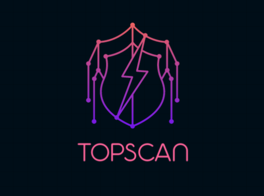
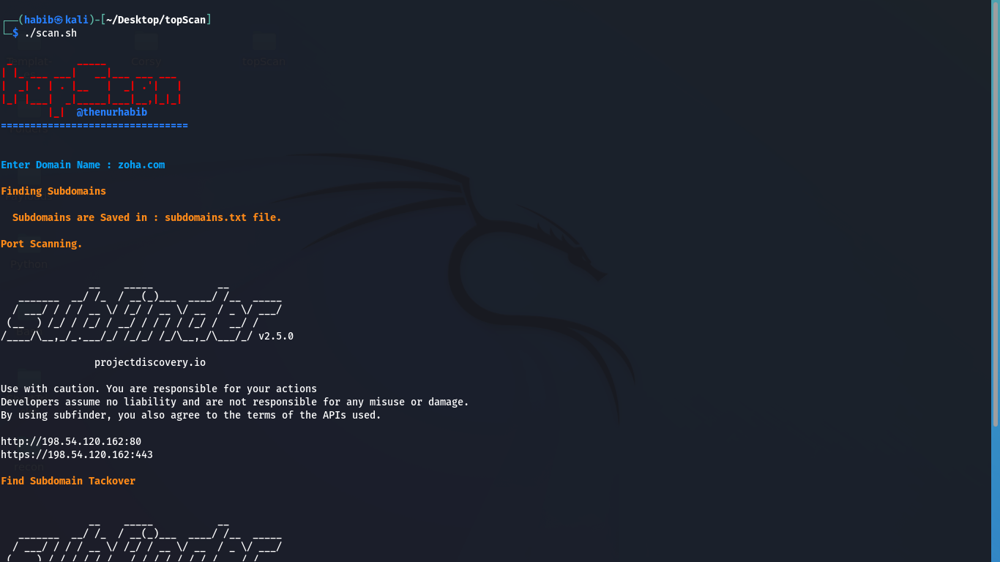

<h1 align="center">
  <br>
  <a  href="https://github.com/thenurhabib/topscan"></a>
  <br>
  TopScan
  <br>
</h1>

<h4 align="center">Web Vulnerability Scanner.</h4>

<p align="center">
  <a href="https://github.com/thenurhabib/topscan/releases">
    
  </a>
  <a href="https://travis-ci.com/thenurhabib/topscan">
    
  </a>
  <a href="https://github.com/thenurhabib/topscan/issues?q=is%3Aissue+is%3Aclosed">
      
  </a>
</p>




```bash
 
 _           _____
| |_ ___ ___|   __|___ ___ ___
|  _| . | . |__   |  _| .'|   |
|_| |___|  _|_____|___|__,|_|_|
        |_|  @thenurhabib 

```


<hr>

### topscan is a fastest automatically vulnerability finder and recon tool.

<br>

### Main Features
- Find Subdomains
- Check for active subdomains
- Check for information disclosure
- Get whois information.
- Get Subdomains from multiple resources
- Dump URLs from sitemap.xml
- Find Hidden Servers and/or Admin Panels
- Find URL Parameter.
- Check for Subdomain Tackover vulnerability.
- Find Cross SIte Scripting (XSS)


<br>


### Documentation
### install
```bash
git clone https://github.com/thenurhabib/topscan.git
cd topscan
chmod +x *
./install.sh
```


#### Usage
```bash
./scan.sh
```
<br>


### Author
```yaml
Name       : Md. Nur habib
Medium     : thenurhabib.medium.com
Twitter    : https://twitter.com/thenurhab1b
HackerRank : https://www.hackerrank.com/thenurhabib

```

##### Thank You.
